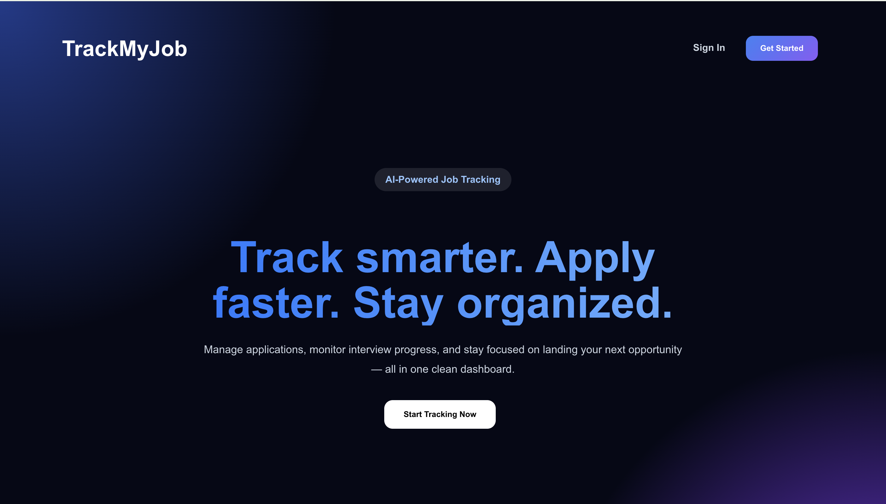
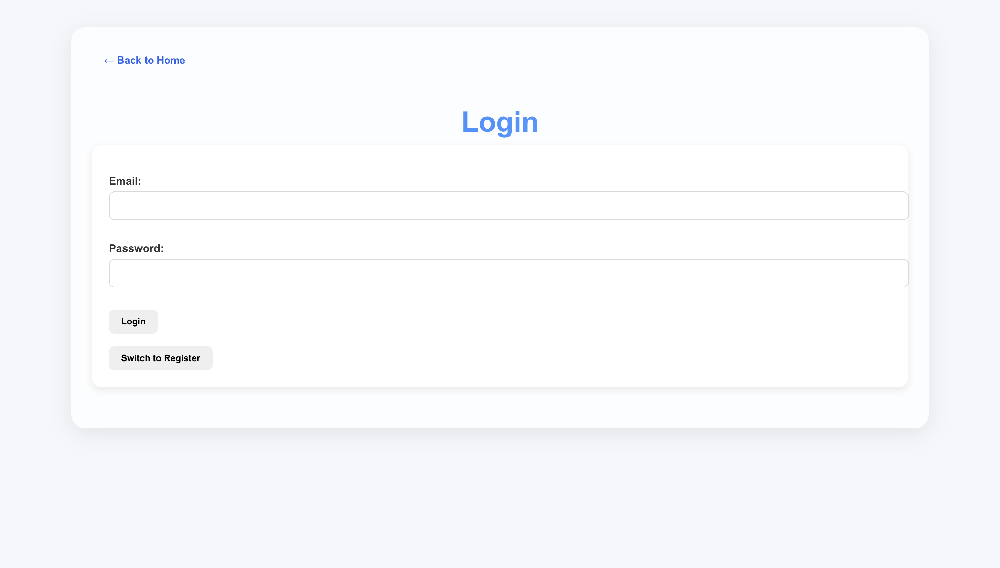
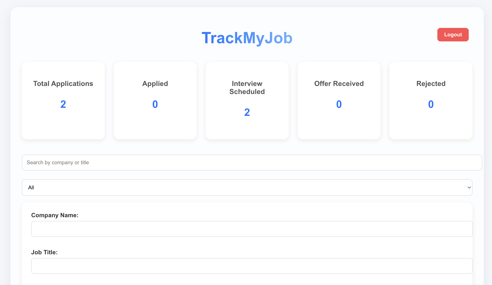
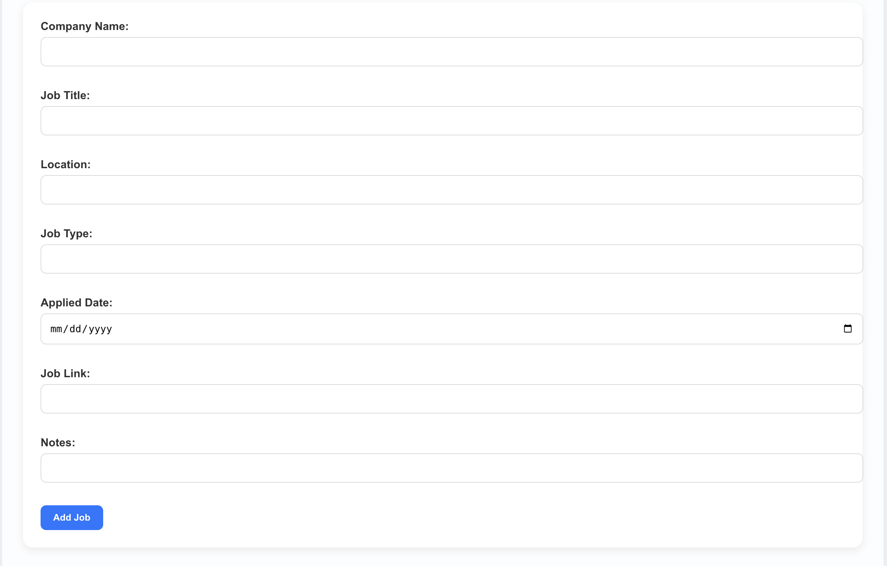
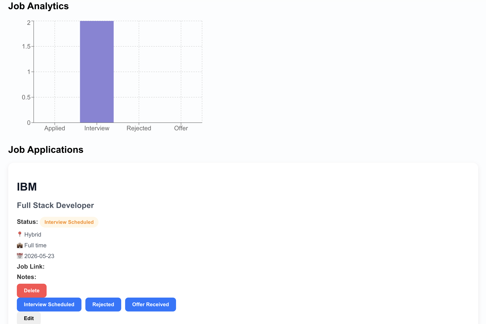

# TrackMyJob AI 📋

TrackMyJob AI is a modern full-stack job application tracking platform that helps users organize, monitor, and manage their entire job search process in one centralized dashboard.

🔗 **Live Demo:** https://trackmyjob-wine.vercel.app

---

# 📸 Screenshots

## Landing Page



---

## Login Page



---

## Dashboard Overview



---

## Add Job Form



---

## Analytics Dashboard


---

# ✨ Features

- Secure JWT-based Authentication System
- User Registration and Login Functionality
- Protected Dashboard Routes
- Add, Edit, Delete Job Applications
- Real-Time Application Status Tracking
- Search and Filter Job Applications
- Interactive Analytics Dashboard using Recharts
- SaaS-style Responsive Landing Page
- REST API Integration with Axios
- PostgreSQL Database Connectivity
- Automatic Session Timeout & Auto Logout after Inactivity
- Error Handling and Loading States
- Fully Responsive UI Design
- Cloud Deployment using Vercel and Render

---

# 🛠️ Tech Stack

## Frontend

| Technology | Purpose |
|------------|---------|
| React.js | Frontend UI Development |
| JavaScript (ES6+) | Core Programming Language |
| CSS3 | Styling & Responsive Design |
| Axios | API Communication |
| Recharts | Analytics & Data Visualization |

---

## Backend

| Technology | Purpose |
|------------|---------|
| Node.js | Server Runtime Environment |
| Express.js | Backend API Framework |
| PostgreSQL | Relational Database |
| JWT | Secure Authentication |
| bcrypt | Password Hashing & Security |

---

## Deployment & Tools

| Technology | Purpose |
|------------|---------|
| Git & GitHub | Version Control |
| Vercel | Frontend Deployment |
| Render | Backend Deployment |
| Postman | API Testing |
| REST APIs | Client-Server Communication |
---

# 🚀 Getting Started

## Prerequisites

- Node.js v18+
- PostgreSQL
- npm

---

## Installation

### 1. Clone Repository

```bash
git clone https://github.com/meesalagit/Trackmyjob.git
cd Trackmyjob
```

---

## Backend Setup

```bash
cd backend
npm install
```

Create `.env` file inside backend:

```env
PORT=5000
DATABASE_URL=your_postgresql_connection_string
JWT_SECRET=your_secret_key
```

Run backend:

```bash
npm start
```

---

## Frontend Setup

```bash
cd frontend
npm install
```

Run frontend:

```bash
npm start
```

---

Open browser:

```bash
http://localhost:3000
```

---

# 📁 Project Structure

```bash
Trackmyjob/
│
├── backend/
│   ├── index.js
│   ├── package.json
│
├── frontend/
│   ├── public/
│   │   └── screenshots/
│   │
│   ├── src/
│   │   ├── App.js
│   │   ├── App.css
│   │
│   └── package.json
│
└── README.md
```

---

# 🔌 API Endpoints

| Method | Endpoint | Description |
|--------|----------|-------------|
| POST | `/register` | Register new user |
| POST | `/login` | Login user |
| GET | `/job-applications` | Get all job applications |
| POST | `/job-applications` | Add new application |
| PUT | `/job-applications/:id` | Update application |
| DELETE | `/job-applications/:id` | Delete application |

---

# 🎯 Technical Highlights

- Full-stack application using React, Node.js, Express.js, and PostgreSQL
- Secure JWT authentication with protected routes
- Real-time dashboard analytics and visual charts
- Full CRUD functionality for job application management
- Modern responsive SaaS-style UI
- RESTful API integration between frontend and backend
- Live cloud deployment using Vercel and Render

---

# 🔮 Future Enhancements

- AI Resume Analyzer
- Resume ATS Score Checker
- Email Notifications
- Interview Reminder System
- Dark/Light Theme Toggle
- Advanced Analytics Dashboard

---

# 👨‍💻 Author

**Tulasi Surendranath Meesala**

- LinkedIn: https://www.linkedin.com/in/tulasi-surendranath-meesala-b20808214
- GitHub: https://github.com/meesalagit

---

# 📄 License

This project is open source and available under the MIT License.